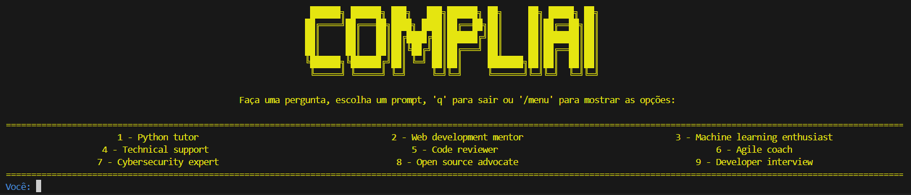

[](https://sonarcloud.io/summary/new_code?id=vertechit_CompliAI)

# CompliAI
Para utilizar este projeto recomendo utilizar o Linux e caso esteja no Windows utilizar o WSL  
  
## Como iniciar o projeto
1. Criar ambiente virtual
```
# Linux / WSL
python3 -m venv .venv
# Windows
python -m venv .venv
```
2. Ativar o ambiente
```
# Linux / WSL
. ./.venv/bin/activate
# Windows
.\.venv\Scripts\activate
```

> Para validar se o ambiente esta ativo pode utilizar o seguinte comando
> `which python3` ou `gcm python` no windows

3. Instalar as bibliotecas
```
pip install -r ./app/requirements.txt
```

## Utilizar o Genie
Após o ambiente configurado é possível usar o "genie" que é um Chat com o GPT para ser utilizado no Terminal.  
Para abrir, digite
```
# Linux
python3 app/main.py

# Windows
python genie/main.py
```



### Subir aplicação inteira
Para subir a aplicação copie o arquivo `example.env` para o arquivo `./deploy/.env` e substitua os valores das chaves de API antes de subir a aplicação
```
docker compose up --build
# Para habilitar o Watch
docker compose watch
```

### Rodar a imagem Docker
```
# Teste de chamada da API
curl -X POST http://127.0.0.1:8080/chain --data '{"HumamMessage": "Quem é o presidente do Brasil?"}' -H "content-type: application/json"

# Anexar documento
curl -X 'POST' \
  'http://127.0.0.1:8080/createDocument/?filename=Document%201&description=Descricao%20de%20documento%201' \
  -H 'accept: application/json' \
  -H 'Content-Type: multipart/form-data' \
  -F 'file=@/mnt/c/dev/Repositorios/CompliAI/arquivos/salarios.csv'
```

### Subir o Genie no Docker
```
docker exec -it compliai-api-1 python3 main.py
```

### Links
QDRant Dashboard: http://localhost:6333/dashboard  
Adminer: http://localhost:8081/  
API: http://localhost:8080/docs  
WebApp: http://localhost/  